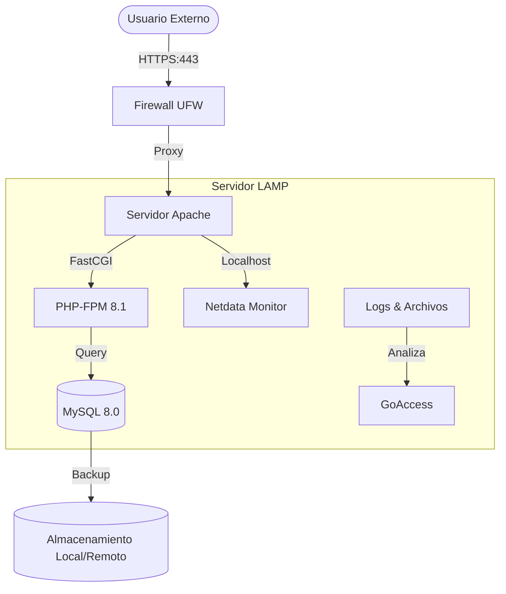

# Diseño de la Infraestructura

Este documento describe la arquitectura técnica, las versiones de software y el diseño de red para la implementación de la pila **LAMP**.

## 1. Especificaciones de Software (Versiones)
Para garantizar la compatibilidad y seguridad del sistema, se han definido las siguientes versiones de los componentes principales:

| Componente | Versión | Descripción |
| :--- | :--- | :--- |
| **Apache** | 2.4.61 | Servidor web (versión actualizada) |
| **MySQL** | 8.0 | Sistema de gestión de bases de datos |
| **PHP** | 8.1+ | Lenguaje de programación de servidor |
| **Java** | JDK 21 | Lenguaje de programación de servidor |
| **Certbot** | 2.9 | Herramienta para SSL/TLS automático |

## 2. Diseño de Red y Seguridad
La infraestructura se organiza para proteger los datos de la PYME mediante el filtrado de tráfico con **UFW**.

### Puertos y Accesos
| Servicio | Puerto | Protocolo | Descripción |
| :--- | :--- | :--- | :--- |
| **SSH** | 22 | TCP | Administración remota segura |
| **HTTP** | 80 | TCP | Tráfico web (redirección a HTTPS) |
| **HTTPS** | 443 | TCP | Tráfico web cifrado (SSL/TLS) |

## 3. Arquitectura del Sistema

La infraestructura sigue un modelo de capas con segmentación de servicios y monitorización integrada.

### 3.1. Tabla de Componentes y Funcionalidad

| Componente | Rol en el Sistema | Configuración Principal |
| :--- | :--- | :--- |
| **Ubuntu Server** | Sistema Operativo Base | Kernel optimizado para red |
| **Apache 2.4** | Servidor Web / Proxy Inverso | `/etc/apache2/sites-available/` |
| **MySQL 8.0** | Almacenamiento Persistente | `/etc/mysql/mysql.conf.d/` |
| **PHP-FPM 8.1** | Intérprete de Scripts | `/etc/php/8.1/fpm/` |
| **Netdata** | Monitorización en Tiempo Real | Puerto 19999 (Local) |
| **GoAccess** | Análisis de Tráfico y Seguridad | `/var/log/apache2/access.log` |
| **UFW** | Seguridad Perimetral | Denegación por defecto |
