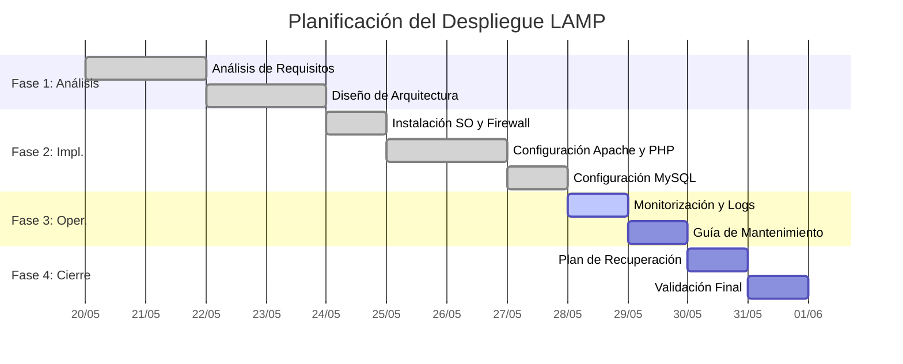

# Planificación del Proyecto

Este documento detalla el cronograma de implementación de la infraestructura LAMP, siguiendo una metodología de despliegue por fases para asegurar la estabilidad del sistema.

---

## 1. Cronograma de Despliegue (Gantt)

A continuación se muestra el diagrama de Gantt con las fases principales del proyecto:

---

## 2. Desglose de Tareas

| Fase | Tarea Principal | Responsable | Estimación |
| :--- | :--- | :--- | :---: |
| **I** | Análisis y Diseño Técnico | yuseflc | 4 días |
| **II** | Instalación y Configuración LAMP | vjp-yuseflc | 3 días |
| **III** | Seguridad y Backup | yuseflc | 2 días |
| **IV** | Monitorización y Operaciones | vjp-yuseflc | 2 días |
| **V** | Pruebas de Recuperación | yuseflc | 2 días |

---

## 3. Hitos Clave (Milestones)

1.  **Hito 1 (2026-05-24):** Diseño de red y servidor validado.
2.  **Hito 2 (2026-05-27):** Pila LAMP operativa y accesible vía HTTPS.
3.  **Hito 3 (2026-05-30):** Sistema de backups y plan de desastres completado.
