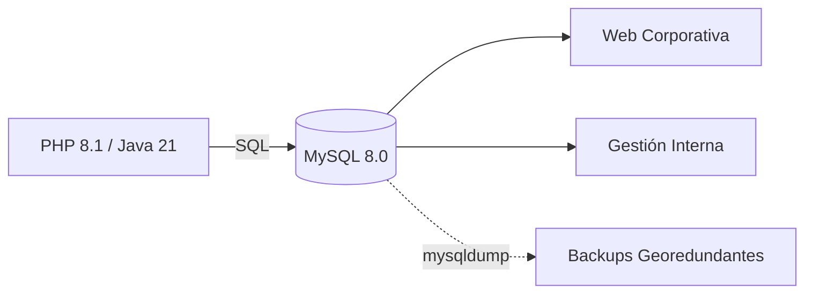

# Base de Datos (MySQL)

Gestión y estructura del sistema de persistencia basado en MySQL 8.0 para la infraestructura LAMP.

## Estructura de Datos y Flujo

## Especificaciones del Motor

| Parámetro | Valor Requerido | Descripción |
| :--- | :--- | :--- |
| **Versión** | MySQL 8.0 | Estándar de seguridad y rendimiento |
| **Instancias** | 2 Mínimo | Web corporativa y sistema de gestión |
| **Backup** | Automatizado | Uso de `mysqldump` y `rsync` |

## Configuración y Seguridad

1. **Protocolo:** El acceso se realiza mediante socket local o TCP en el puerto 3306 (restringido por el [Firewall](ssh-firewall.md)).
2. **Respaldo:** Se sigue la estrategia definida en el plan de [Backups](backups.md) con rotación de archivos.
3. **Mantenimiento:** Supervisión constante desde [Monitorización](monitorizacion.md) (Netdata).

## Enlaces de Interés
- [Volver al Servidor Web](servidor-web.md)
- [Análisis de Requisitos](../01-analisis.md)
