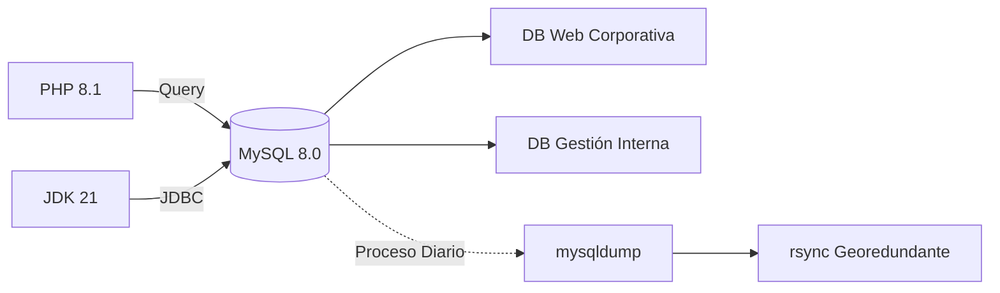

# Base de Datos (MySQL)

Gestión, estructura y seguridad del sistema de persistencia basado en **MySQL 8.0** para la infraestructura LAMP de la PYME.

## Estructura de Datos y Flujo

## Especificaciones del Motor

| Parámetro | Valor Requerido | Justificación |
| :--- | :--- | :--- |
| **Versión** | MySQL 8.0 | Estándar actual de seguridad, rendimiento y soporte de JSON. |
| **Bases de Datos** | 2 Mínimo | Segregación de datos: Web Corporativa y Gestión Interna. |
| **Backup** | Automatizado | Estrategia de `mysqldump` + `rsync` para redundancia externa. |
| **Monitoreo** | Netdata | Supervisión de queries lentas, hilos activos y uso de buffer. |

## Configuración y Endurecimiento (Hardening)

Para cumplir con los **Requisitos de Seguridad Activa** definidos en el [Análisis](../01-analisis.md):

*   **Acceso Restringido:** El motor se configura para escuchar únicamente en `127.0.0.1` o sockets locales, impidiendo conexiones externas directas.
*   **Gestión de Usuarios:**
    *   No se permite el acceso remoto al usuario `root`.
    *   Cada aplicación (Web/Gestión) dispone de un usuario propio con permisos limitados al esquema correspondiente.
*   **Puerto de Servicio:** El puerto estándar `3306/TCP` está bloqueado en el [Firewall](ssh-firewall.md).

## Estrategia de Backup y Recuperación

Según el [Plan de Recuperación](../06-recuperacion.md) y los requisitos del cliente:

1.  **Exportación:** Uso de `mysqldump` con parámetros de consistencia por cada base de datos.
2.  **Sincronización:** Empleo de `rsync` sobre túneles seguros para mover las copias a un servidor externo.
3.  **Rotación:** Sistema de rotación diaria para conservar historial de los últimos 7 días.

## Integración con el Ecosistema
- **Servidor Web:** El [Servidor Web](servidor-web.md) (Apache/PHP) es el principal cliente de datos.
- **Monitorización:** Integración con [Monitorización](monitorizacion.md) mediante Netdata para alertas de disponibilidad.

## Documentación Vinculada
- [01-analisis.md](../01-analisis.md)
- [02-diseno.md](../02-diseno.md)
- [Plan de Backups](backups.md)
