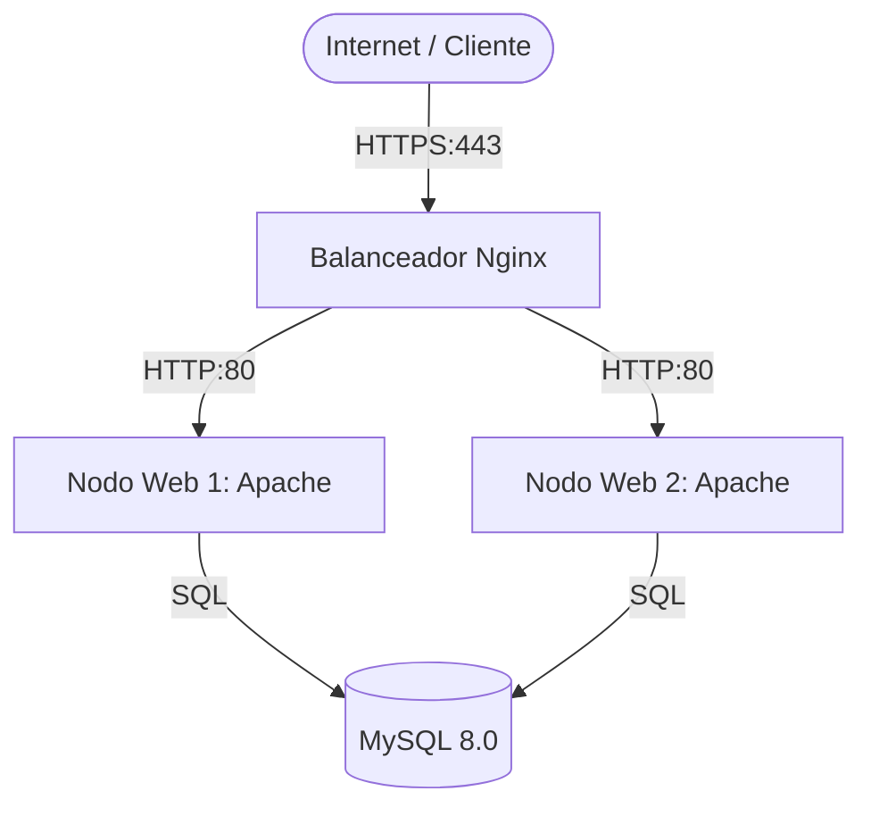

# Servidor Web (Apache) e Infraestructura de Balanceo

Instalación y configuración de la capa de servicio web y el sistema de alta disponibilidad para la PYME.

## Arquitectura de Aplicación con Balanceador



## 1. Configuración del Servidor Web (Apache)

| Componente | Versión | Rol |
| :--- | :--- | :--- |
| **Apache** | 2.4.61 | Servidor de aplicaciones (Nodos redundantes) |
| **PHP** | 8.1+ | Procesamiento del backend |
| **Certbot** | 2.9 | Gestión de certificados SSL en el balanceador |

### Procedimiento en los Nodos Web
1.  **Instalación:** `apt install apache2 php8.1-fpm`
2.  **Optimización:** Configuración de `mpm_event` para manejar alta concurrencia.
3.  **Habilitación de Módulos:** `a2enmod proxy_fcgi setenvif rewrite`

## 2. Configuración del Balanceador de Carga (Nginx)

Para mejorar la disponibilidad, se implementa un balanceador **Nginx 1.24** en modo Reverse Proxy.

### Parámetros del Balanceador
*   **Algoritmo:** Round Robin (por defecto) o Least Connections.
*   **Terminación SSL:** El balanceador gestiona el cifrado (HTTPS), descargando de trabajo a los nodos Apache.

### Ejemplo de Configuración Upstream
```nginx
upstream backend_nodes {
    server 192.168.1.10:80 weight=5;
    server 192.168.1.11:80;
}

server {
    listen 443 ssl;
    server_name www.pyme.com;

    location / {
        proxy_pass http://backend_nodes;
        proxy_set_header Host $host;
        proxy_set_header X-Real-IP $remote_addr;
    }
}
```

## Integración
- **Capa de Datos:** Los nodos web conectan individualmente a la [Base de Datos](base-de-datos.md).
- **Seguridad:** El [Firewall](ssh-firewall.md) debe permitir el tráfico entre el LB y los nodos web en el puerto 80 interno.
