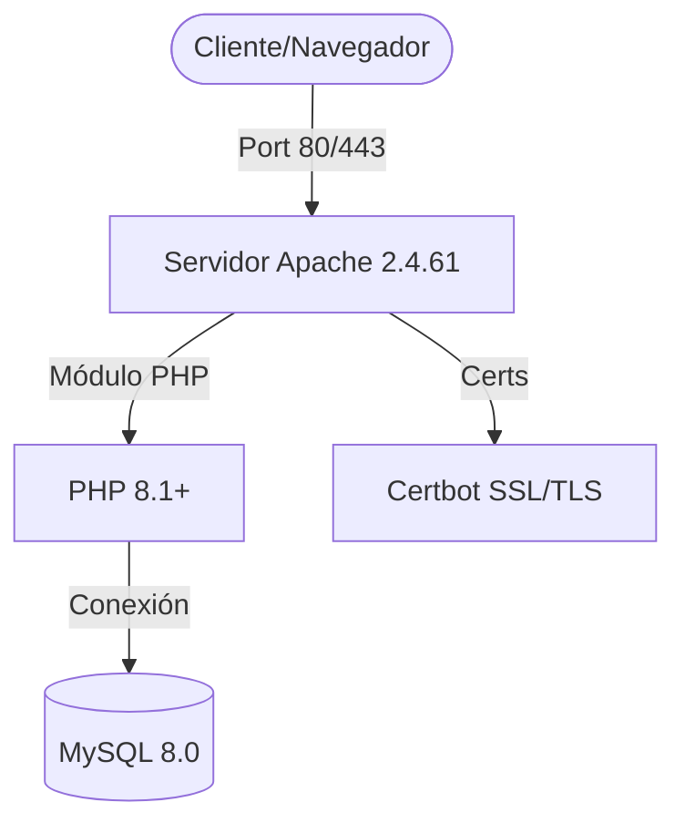

# Servidor Web (Apache)

Instalación y configuración del servidor web según los requisitos de infraestructura LAMP para la PYME.

## Arquitectura de Aplicación

## Especificaciones y Versiones

| Componente | Versión | Rol |
| :--- | :--- | :--- |
| **Apache** | 2.4.61 | Procesamiento de peticiones externas |
| **PHP** | 8.1+ | Lógica de negocio y gestión interna |
| **Certbot** | 2.9 | Automatización de certificados SSL/TLS |

## Procedimiento de Instalación

1. **Instalación de Apache:**
   - Ubicación de configuración: `/etc/apache2/`
2. **Habilitación de Módulos:**
   - `a2enmod rewrite`
   - `a2enmod ssl`
3. **Cifrado:**
   - Implementación de Certbot para tráfico seguro (Puerto 443).

## Integración
- **Capa de Datos:** Conexión directa con la [Base de Datos](base-de-datos.md).
- **Seguridad:** El tráfico solo es permitido si el [Firewall](ssh-firewall.md) tiene abiertos los puertos 80 y 443.
