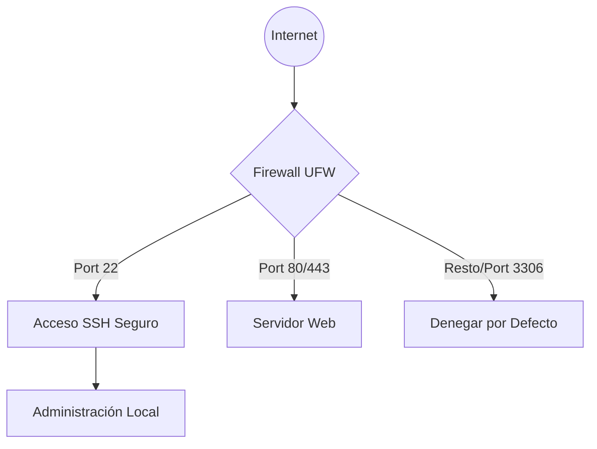

# Seguridad: SSH y Firewall (UFW)

Este documento detalla la configuración de acceso seguro y el filtrado de tráfico para la infraestructura de la PYME, garantizando la integridad de los servicios web y de bases de datos.

## Arquitectura de Seguridad



## Reglas de Firewall (UFW)

Según el [Diseño de la Infraestructura](../02-diseno.md), se deben implementar las siguientes reglas de "denegación por defecto" para minimizar la superficie de ataque.

| Servicio | Puerto | Protocolo | Acción | Descripción |
| :--- | :--- | :--- | :--- | :--- |
| **SSH** | 22 | TCP | ALLOW | Administración remota segura |
| **HTTP** | 80 | TCP | ALLOW | Tráfico web (Redirección a HTTPS) |
| **HTTPS** | 443 | TCP | ALLOW | Tráfico web cifrado (SSL/TLS) |
| **MySQL** | 3306 | TCP | **DENY** | Bloqueado al exterior (Solo local) |
| **Cualquier otro** | Todos | - | DENY | Política de seguridad por defecto |

## Configuración Avanzada de SSH

Para cumplir con el [Análisis de Requisitos](../01-analisis.md) sobre acceso seguro, se deben seguir estas pautas:

*   **Deshabilitar acceso Root:** Se recomienda prohibir el login directo como root (`PermitRootLogin no`) para obligar el uso de usuarios con `sudo`.
*   **Autenticación por Llaves:** Sustituir las contraseñas tradicionales por llaves criptográficas (RSA de 4096 bits o Ed25519).
*   **Deshabilitar contraseñas vacías:** Asegurar que `PermitEmptyPasswords no` esté configurado en `/etc/ssh/sshd_config`.
*   **Limitación de Intentos:** Implementar herramientas como Fail2Ban para bloquear IPs tras varios intentos fallidos.

## Gestión del Firewall (UFW)

El cortafuegos se gestionará mediante la herramienta `ufw` (Uncomplicated Firewall). Los pasos básicos son:

1.  **Estado inicial:** Establecer políticas por defecto:
    ```bash
    ufw default deny incoming
    ufw default allow outgoing
    ```
2.  **Apertura de puertos necesarios:**
    ```bash
    ufw allow 22/tcp
    ufw allow 80/tcp
    ufw allow 443/tcp
    ```
3.  **Activación:** `ufw enable`.

## Integración y Dependencias

*   **Base de Datos:** El motor de [Base de Datos](base-de-datos.md) queda protegido tras el firewall. Las conexiones solo son permitidas desde el localhost (127.0.0.1) o la red interna de confianza.
*   **Servidor Web:** El [Servidor Web](servidor-web.md) es el único componente expuesto públicamente a través de los puertos de navegación estándar.
*   **Monitorización:** El sistema de [Monitorización](monitorizacion.md) supervisará el estado de las reglas y alertará sobre bloqueos masivos.

## Documentación de Referencia
*   [Análisis Inicial de Requisitos](../01-analisis.md)
*   [Especificaciones de Diseño](../02-diseno.md)
*   [Guía de Recuperación ante Desastres](../06-recuperacion.md)
