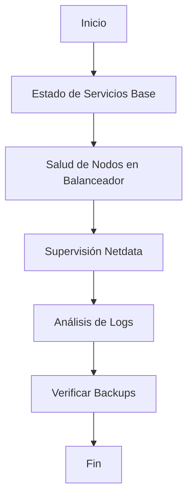

# Guía de Mantenimiento Diario (Operación)

Este documento detalla los procedimientos necesarios para garantizar la estabilidad, seguridad y el rendimiento óptimo de la infraestructura LAMP instalada, incluyendo la gestión del balanceador de carga.

---

## 1. Flujo de Trabajo Operativo



---

## 2. Checklist de Mantenimiento Diario

| Tarea | Prioridad | Herramienta | Verificación |
| :--- | :---: | :--- | :--- |
| **Balanceador (LB)** | Alta | `nginx -t` / `status` | Verificar que el LB distribuye tráfico correctamente |
| **Salud de Nodos** | Alta | `curl -I` | Los nodos Apache deben responder 200 OK desde el LB |
| **Disponibilidad LAMP** | Alta | `systemctl` | Apache, MySQL y PHP activos en todos los nodos |
| **Rendimiento** | Media | `Netdata` | Carga balanceada entre nodos (variación < 20%) |
| **Copias de Seguridad** | Crítica | `ls` / `du` | Comprobar generación de backup nocturno |

---

## 3. Procedimientos del Balanceador de Carga

### 3.1. Verificación de Nodos Activos
Es crítico asegurar que el balanceador no esté enviando tráfico a nodos caídos. Revise el log de errores del balanceador:
```bash
tail -f /var/log/nginx/error.log | grep "upstream"
```

### 3.2. Rotación de Servicios (Mantenimiento sin Caída)
Para realizar mantenimiento en un nodo web (Nodo 1) sin detener el servicio total:
1.  **Poner en modo mantenimiento:** En la configuración del LB, marcar el servidor como `down`.
2.  **Recargar LB:** `sudo nginx -s reload`.
3.  **Operar en Nodo 1:** Parar apache, actualizar, reiniciar.
4.  **Reincorporar:** Quitar la marca `down` y volver a recargar el LB.

### 3.3. Análisis de Tráfico en el LB
Utilice **GoAccess** directamente sobre el log del Balanceador para tener una visión global de los visitantes únicos y geolocalización.

---

## 4. Gestión de Incidentes Comunes

| Incidente | Causa Probable | Solución Sugerida |
| :--- | :--- | :--- |
| **Error 502 Bad Gateway** | Nodos Apache caídos tras el LB | Verificar `systemctl status apache2` en los nodos esclavos |
| **Sesiones que se cierran** | Falta de IP persistente (Sticky Sessions) | Configurar `ip_hash` en el bloque upstream del balanceador |
| **Exceso de carga en un solo nodo** | Algoritmo de balanceado inadecuado | Ajustar `weight` o cambiar a `least_conn` |

---

## 5. Procedimiento de Actualización de Seguridad

1. **Servidores Web/BD:** Actualizar siguiendo el flujo estándar (apt update/upgrade).
2. **Balanceador:** Es el punto más crítico. Realizar actualizaciones en ventanas de bajo tráfico y siempre tras una prueba de sintaxis de configuración.
