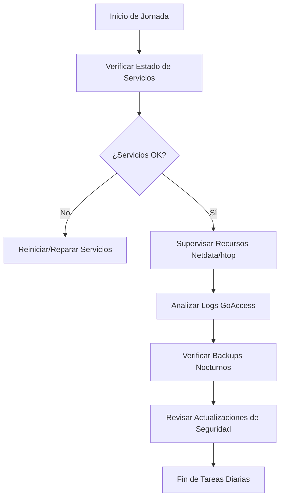

# Guía de Mantenimiento Diario (Operación)

Este documento detalla los procedimientos necesarios para garantizar la estabilidad, seguridad y el rendimiento óptimo de la infraestructura LAMP instalada. La correcta ejecución de estas tareas previene caídas del servicio y asegura la integridad de los datos de la PYME.

---

## 1. Flujo de Trabajo Operativo

El siguiente diagrama resume el orden lógico de las revisiones diarias que debe realizar el administrador de sistemas:



---

## 2. Checklist de Mantenimiento Diario

| Tarea | Prioridad | Herramienta | Verificación |
| :--- | :---: | :--- | :--- |
| **Disponibilidad LAMP** | Alta | `systemctl` | Apache, MySQL y PHP deben estar `active (running)` |
| **Rendimiento** | Media | `Netdata` / `htop` | Carga de CPU < 70%, RAM libre > 15% |
| **Logs de Acceso** | Seguridad | `GoAccess` | Identificar IPs con excesivos errores 403 o 404 |
| **Copias de Seguridad** | Crítica | `ls` / `du` | Comprobar que el backup nocturno se generó correctamente |
| **Espacio en Disco** | Media | `df -h` | Comprobar que `/` no supere el 85% de capacidad |

---

## 3. Procedimientos Detallados

### 3.1. Verificación de Servicios
Es fundamental que los tres pilares del servidor web estén operativos. Ejecute el siguiente comando para una revisión rápida:

```bash
systemctl status apache2 mysql php*-fpm
```
Si algún servicio ha fallado, consulte los logs del sistema: `journalctl -xe`.

### 3.2. Supervisión de Recursos en Tiempo Real
Utilice **Netdata** para observar tendencias históricas de las últimas 24 horas y **htop** para identificar procesos específicos que consuman memoria.

- **URL de Netdata:** `http://localhost:19999` (o según configuración local).
- **Control con htop:** Ejecute `htop` y pulse `F6` para ordenar por uso de memoria o CPU.

### 3.3. Análisis de Logs con GoAccess
Para detectar escaneos de vulnerabilidades o ataques de fuerza bruta en el servidor web:

```bash
sudo goaccess /var/log/apache2/access.log -c --log-format=COMBINED
```
Busque patrones inusuales en la sección de "Requested Files" y "Visitors' IPs".

### 3.4. Validación de Copias de Seguridad
Consulte el directorio definido en la [Estrategia de Backups](../04-instalacion/backups.md):

```bash
ls -lh /backup/db/ /backup/files/
```
**Acción Crítica:** Si el tamaño del backup es de 0 bytes o significativamente menor al día anterior, se debe ejecutar un backup manual inmediatamente y revisar el script de automatización.

---

## 4. Gestión de Incidentes Comunes

A continuación se presenta una tabla de resolución de problemas rápidos para incidentes detectados durante el mantenimiento diario:

| Incidente | Causa Probable | Solución Sugerida |
| :--- | :--- | :--- |
| **Error 500 en la Web** | Fallo en PHP-FPM o error de sintaxis en .htaccess | `sudo systemctl restart php*-fpm` y revisar logs de error de Apache |
| **Conexión rechazada BD** | MySQL detenido o falta de espacio en disco | `df -h` para verificar disco y `sudo systemctl start mysql` |
| **Lentitud extrema** | Proceso zombi o ataque DoS | Identificar IP en `GoAccess` y bloquear con `ufw deny from [IP]` |
| **Fallo de Backup** | Permisos incorrectos o destino lleno | Revisar `chmod` de la carpeta `/backup` y espacio en disco |

---

## 5. Procedimiento de Actualización de Seguridad

Para mantener la integridad del sistema, se debe revisar la disponibilidad de parches de seguridad diariamente:

1. **Sincronizar repositorios:**
   ```bash
   sudo apt update
   ```
2. **Consultar paquetes críticos:**
   ```bash
   sudo apt list --upgradable | grep -i security
   ```
3. **Aplicar actualizaciones (si es necesario):**
   *(Nota: Realizar siempre después de verificar la integridad del backup diario)*
   ```bash
   sudo apt upgrade -y
   ```

---

## 6. Mantenimiento Semanal (Complementario)
Aunque el foco es diario, se recomienda realizar estas acciones cada 7 días:
- **Limpieza de archivos temporales:** `sudo apt autoremove && sudo apt autoclean`.
- **Rotación de Logs:** Verificar que `logrotate` está funcionando correctamente en `/etc/logrotate.d/`.
- **Prueba de Restauración:** Intentar restaurar una base de datos en un entorno de pruebas para validar el backup.

---

## 7. Enlaces de Interés
- [Plan de Instalación y Configuración](./04-instalacion/servidor-web.md)
- [Monitorización Detallada](./04-instalacion/monitorizacion.md)
- [Plan de Recuperación ante Desastres](./06-recuperacion.md)
- [Estrategia de Copias de Seguridad](./04-instalacion/backups.md)
- [Análisis de Requisitos](./01-analisis.md)
