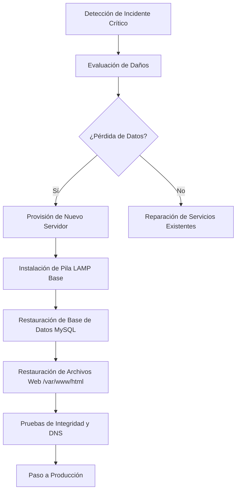

# Plan de Recuperación ante Desastres (DRP)

Este documento define la estrategia y los procedimientos técnicos para restaurar la operatividad de la infraestructura LAMP tras un incidente crítico o pérdida total de datos.

---

## 1. Objetivos de Recuperación (RTO y RPO)

Para garantizar la continuidad del negocio, se establecen los siguientes indicadores clave:

- **RPO (Recovery Point Objective):** Máximo 24 horas (correspondiente al último backup nocturno).
- **RTO (Recovery Time Objective):** Máximo 4 horas para restaurar el servicio web y la base de datos tras la provisión del hardware/instancia.

---

## 2. Protocolo de Actuación ante Desastres

El siguiente diagrama detalla la ruta crítica de recuperación:



---

## 3. Matriz de Gravedad e Impacto

| Nivel | Escenario | Impacto | Acción Inmediata |
| :---: | :--- | :--- | :--- |
| **Bajo** | Error de servicio (Apache/MySQL) | Web caída temporalmente | Reinicio de servicios (Ver [Guía de Operación](./05-operacion.md)) |
| **Medio** | Corrupción parcial de BD | Datos desactualizados | Restaurar tabla o base de datos específica |
| **Alto** | Borrado accidental de archivos web | Web inaccesible | Restaurar de `/backup/files/` |
| **Crítico** | Fallo de Hardware / Ransomware | Pérdida total de servicio | Ejecutar Plan de Recuperación Completo |

---

## 4. Procedimientos Técnicos de Restauración

### 4.1. Restauración de Bases de Datos
En caso de corrupción o pérdida de datos en MySQL/MariaDB:

1. **Localizar el backup más reciente:**
   ```bash
   ls -ltr /backup/db/full_backup_*.sql
   ```
2. **Importar los datos:**
   ```bash
   # Recrear la base de datos si es necesario y cargar el volcado
   mysql -u root -p < /backup/db/full_backup_2026-05-27.sql
   ```

### 4.2. Restauración del Código Fuente y Assets
Si los archivos en `/var/www/html` han sido dañados o borrados:

1. **Limpiar el directorio destino:**
   ```bash
   sudo rm -rf /var/www/html/*
   ```
2. **Descomprimir el backup:**
   ```bash
   sudo tar -xzvf /backup/files/web_backup_2026-05-27.tar.gz -C /
   ```
3. **Restablecer permisos:**
   ```bash
   sudo chown -R www-data:www-data /var/www/html
   ```

### 4.3. Restauración en Servidor Nuevo (Bare Metal)
Si se debe recrear la infraestructura desde cero:

1. **Instalar dependencias:** Consultar [Guía de Instalación](./04-instalacion/servidor-web.md).
2. **Recuperar Backups Externos:** Descargar las copias desde el almacenamiento remoto vía `rsync` o `scp`.
3. **Aplicar pasos 4.1 y 4.2.**
4. **Verificar Firewall:** Reaplicar reglas de [SSH y Firewall](./04-instalacion/ssh-firewall.md).

---

## 5. Contactos de Emergencia y Soporte

- **Administrador de Sistemas (Operaciones):** vjp-yuseflc
- **Documentalista de Plataforma:** yuseflc
- **Proveedor de Hosting/Cloud:** [Nombre del Proveedor/Soporte]

---

## 6. Enlaces de Referencia
- [Estrategia de Copias de Seguridad](./04-instalacion/backups.md)
- [Guía de Mantenimiento Diario](./05-operacion.md)
- [Instalación de la Base de Datos](./04-instalacion/base-de-datos.md)
